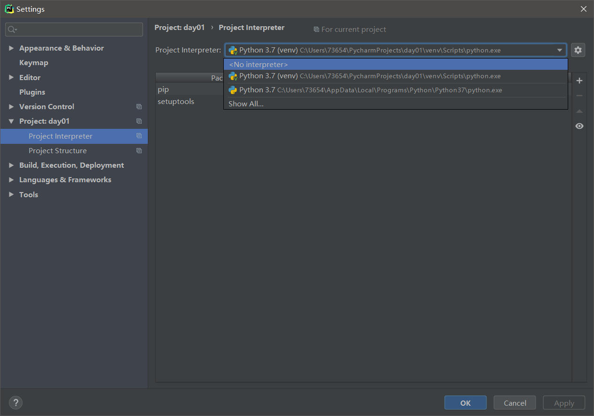

# Pycharm安装和使用

## 1. 安装过程

+ 浏览器访问<https://www.jetbrains.com/pycharm/download/>
+ 破解过程 && 汉化过程 略

## 2. 一些设置

* 设置编辑器字体 File --> Settings --> Editor --> Font
* 设置控制台字体 File --> Settings --> Editor --> Font --> Color Scheme --> Console Font
* 选择Python解释器 File --> Settings --> Project:xx --> Python Interpreter
